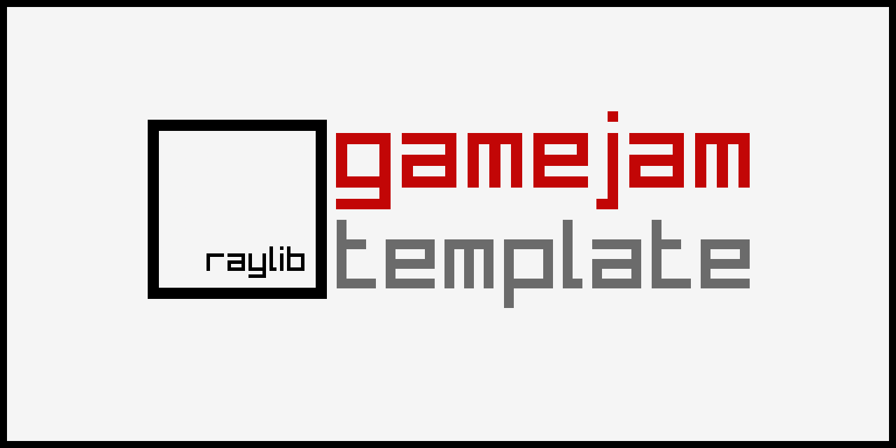

## Bitcoin Fixes This

### [Play Now](https://mrjones91.github.io/BFT/src/build/raylib_game.html) 

1) Clone Repo to play on your OS

2) Known Bugs on Web:

    Layout is wonky

    Camera does not scroll on web

### [Build]

To build the game locally, you'll need to install [Raylib](https://raylib.com)

NOTE. You may need 2 compiled versions. 1 for your OS 1 for building for Web.

In src/Makefile the RAYLIB_SRC_PATH should be set to the specific Raylib build for the env you're deploying to.

The game executable will be in the build folder after running `make`

### Description

#### Vision
Built in C and design to run on HTML5 with Emscripten. Current web build doesn't scroll.
- 4 levels exist, need to fully design levels.
- Design and animate Player
- Add Enemies and Obstacles
- Implement Narrative
- Rewrite in Zig

#### Checklist
DONE
jump kinda works
keep camera

TODO
main - loads screenmanager -> loads each platform level
bitcoin power icon in corner
map as 0,1 tileset
tile convert rendering
settle on camera mode
1 good level
random level generation?
emscripten tutorial
make inscription
submit buidl

IDEA
Enemy is an Shady Organization - Robots - Eagles, Soldiers, CorporateSuits, MegaEagleRobotInSuitWithGavel
level 1 White - seemingly plain, deceptively evil. coerced the world. lift the veil - Eagle Bots
Blue - seemingly peaceful, actually forceful. must be stopped - CorporateSuits
Red - bloody violent, absolute power. How can we overcome it? - Soldiers
Green - Final boss, the one to rule them all. infinite slavery - MegaEagleRoboSuitWithGavel

Player 
Orange - You, the hero, the difference. Orange Pill the world

### Features

 - $(Project Feature 01)
 - $(Project Feature 02)
 - $(Project Feature 03)

### Controls

Keyboard/Mouse:
 - $(Project Controls 01)
 - $(Project Controls 02)
 - $(Project Controls 03)

### Screenshots

_TODO: Show your game to the world, animated GIFs recommended!._

### Developers

 - $(Developer 01) - $(Role/Tasks Developed)
 - $(Developer 02) - $(Role/Tasks Developed)
 - $(Developer 03) - $(Role/Tasks Developed)

### Links

 - YouTube Gameplay: $(YouTube Link)
 - itch.io Release: $(itch.io Game Page)
 - Steam Release: $(Steam Game Page)

### License

This project sources are licensed under an unmodified zlib/libpng license, which is an OSI-certified, BSD-like license that allows static linking with closed source software. Check [LICENSE](LICENSE) for further details.

$(Additional Licenses)

*Copyright (c) 2024 $(User Name) ($(User Twitter/GitHub Name))*
